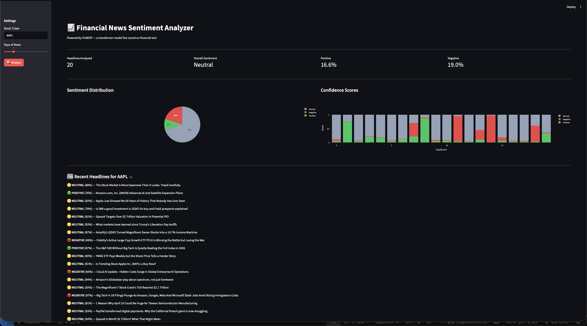
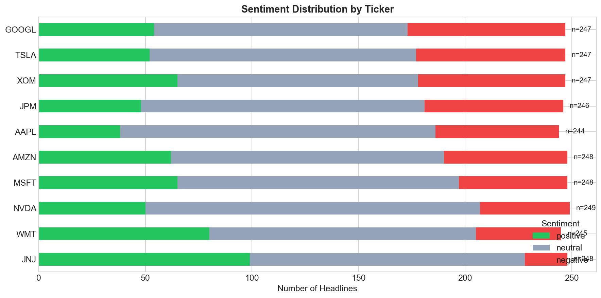
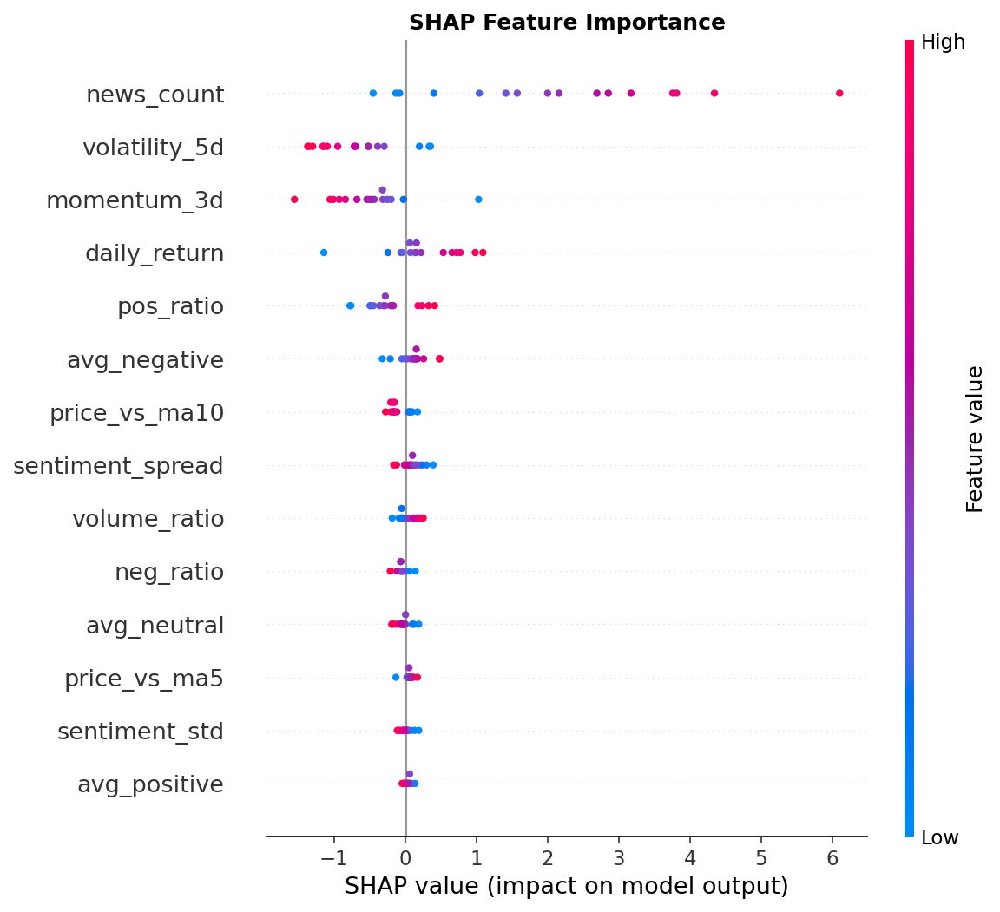
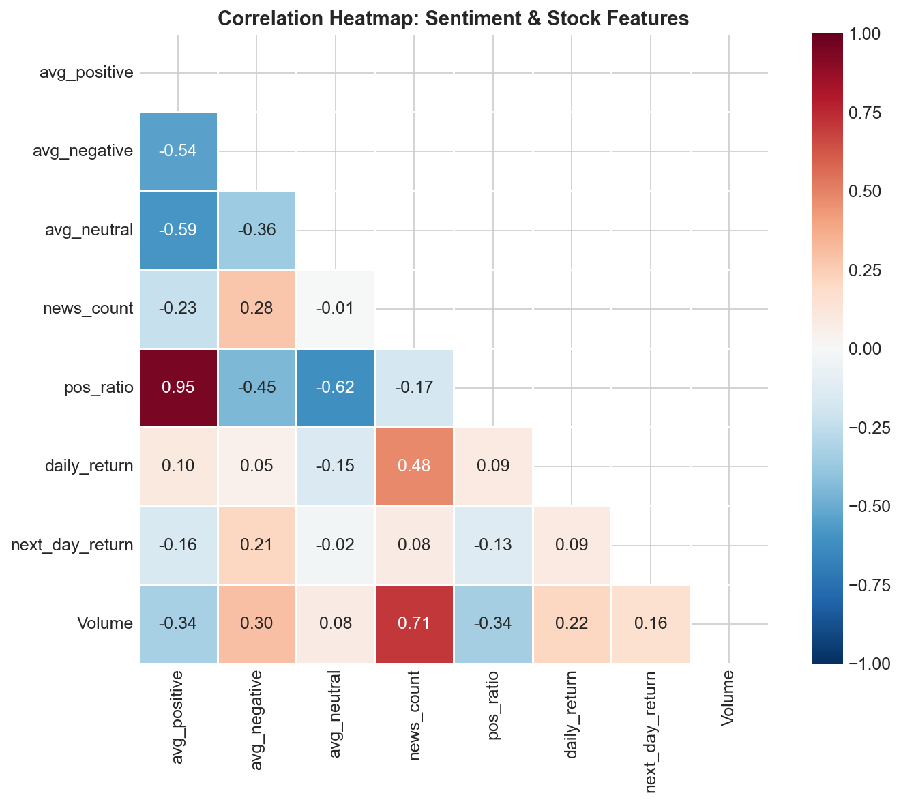

# 📈 Financial News Sentiment Analyzer

An end-to-end machine learning system that analyzes financial news sentiment using FinBERT (a transformer model fine-tuned on financial text) and explores its relationship with stock price movements.

## Architecture
Finnhub API → News Headlines → FinBERT Sentiment Analysis → Feature Engineering
↓
Yahoo Finance → Stock Prices → Technical Indicators → ML Model (Logistic Regression)
↓
FastAPI Backend → Streamlit Dashboard
## Key Findings

- **Counterintuitive sentiment-return relationship**: Positive news sentiment shows a negative correlation (-0.16) with next-day returns, consistent with the "buy the rumor, sell the news" effect
- **Top predictive features**: News volume, 5-day volatility, and 3-day momentum were the strongest predictors (via SHAP analysis)
- **Sector patterns**: GOOGL and TSLA receive the most negative coverage; JNJ and WMT skew positive — reflecting tech volatility vs defensive sector stability

## Screenshots

### Streamlit Dashboard


### Sentiment Distribution by Ticker


### SHAP Feature Importance


### Correlation Heatmap


## Tech Stack

| Component | Technology | Purpose |
|-----------|-----------|---------|
| NLP Model | FinBERT (HuggingFace Transformers) | Financial sentiment classification |
| ML Models | Scikit-learn, XGBoost | Stock direction prediction |
| Explainability | SHAP | Model interpretability |
| Data Pipeline | Finnhub API, yfinance, SQLite | News + stock data collection & storage |
| API | FastAPI | Model serving with auto-generated docs |
| Dashboard | Streamlit, Plotly | Interactive visualization |
| Language | Python (Pandas, NumPy) | Data processing |

## Quick Start

### 1. Clone and install
```bash
git clone https://github.com/karthikeyansett1/financial-sentiment-analyzer.git
cd financial-sentiment-analyzer
python -m venv venv
source venv/bin/activate
pip install -r requirements.txt
```

### 2. Set up API key
Get a free key at [finnhub.io](https://finnhub.io) and create a `.env` file: